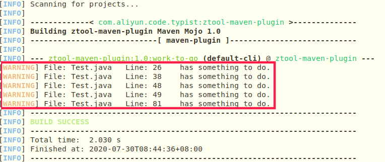

## ztool-maven-plugin
### 介绍
ztool-maven-plugin Maven 插件，是作者在学习 Maven 过程中练手的一个小项目，目前只有一个插件目标: work-to-go，用于检测项目中 Java 注释中是否包含有 TODO 并打印警告信息。

### 使用方法 / 步骤
1.prerequisite

  - Maven: 作者使用的版本是 Maven 3.6.0
  - JDK 1.8

2.安装插件
  - 下载该项目
    ```shell script
      git clone https://github.com/I-Love-China/ztool-maven-plugin.git && cd ztool-maven-plugin
    ```
  - 编译安装
    ```shell script
      mvn clean install
    ```
  
  - 修改 Maven 配置($M2_HOME/settings.xml)，将 com.aliyun.code.typist 添加进 PluginGroup
     ```xml
      <pluginGroups>
          <pluginGroup>com.aliyun.code.typist</pluginGroup>
      </pluginGroups>
     ```

3.在目标项目下使用
  ```shell script
    mvn ztool:work-to-go
  ```

